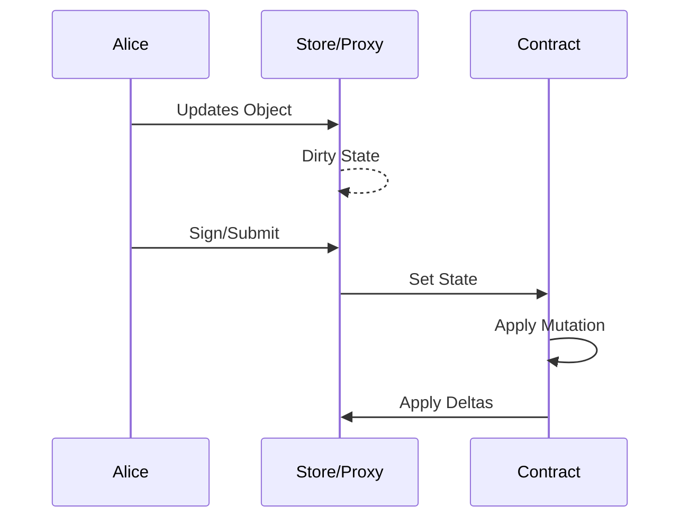
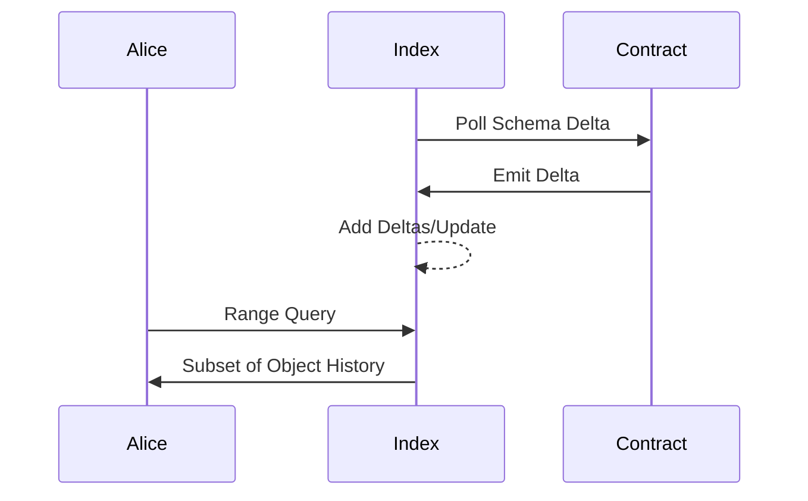

# Discovery

This document is for learning more about the vision and the state of this project.

> Create Objects in our preferred languages that can reflect their state on-chain in an addressable manner.

## Conceptual State Flows

The `Store/Proxy` is representative of the Object or "instance of a Schema"

### Client

### Indexer

We can subset the history based on the schema definitions and preform range based queries

### Challenges/Thoughts:

This document is left open to discussion, it has been KISS to derive the best solution.
The demo solution works as it is but is not production grade or highly optimized.

#### Encoding/Decoding [TBD]

Packing the data will be a fundamental requirement to preserve space on-chain, 
optimizations will have downstream access/indexing effects. 

- [ARC4](https://dev.algorand.co/arc-standards/arc-0004/#encoding) — ABI Standard
- ~~[ARC32](https://dev.algorand.co/arc-standards/arc-0032/)~~ — Deprecated by ARC56
- [ARC56](https://dev.algorand.co/arc-standards/arc-0056/) — Application Specification Extension
- ARC? — Extend the specification to include addressable/public content for consumption and indexing

#### Data Access [WIP]

Extend ARC28 for object lifecycle events to all clients (delete, create)
Rely on ARC?? for object mutations and observation (update)

- [CRDT](https://en.wikipedia.org/wiki/Conflict-free_replicated_data_type)
- [differential-dataflow](https://timelydataflow.github.io/differential-dataflow/)

#### Validation [TBD]

Object validation could be done with JSON Schema or 
equivalent which can produce/consume type validation.

#### Indexing [WIP]

KeyName scan operations at O(log N) for the schema keys

- [B+Tree](https://en.wikipedia.org/wiki/B%2B_tree) (CouchDB for Testing)
- [Fractal Tree Index](https://en.wikipedia.org/wiki/Fractal_tree_index) (?)
- [differential-dataflow](https://timelydataflow.github.io/differential-dataflow/) (?)

#### Out of Scope

Future work can include but is not limited to:

- Permissioned Access
- Object Relational Model
- Privacy
