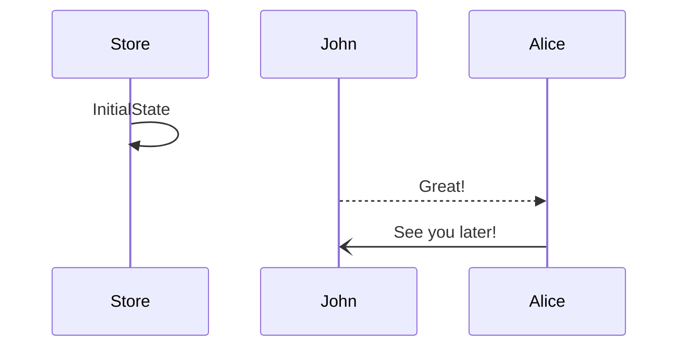

#
- Store created (needs Algorand Client)
- Store state mutation (onUpdate/Subscribe)
- Chain state mutation (uses setState onChainUpdate (overridable))

```mermaid
sequenceDiagram
    Store->>Store: InitialState
    
    John-->>Alice: Great!
    Alice-)John: See you later!
```
