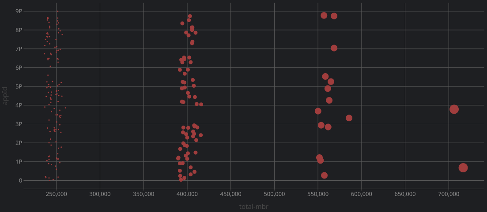

Records in Algorand Smart Contracts are stored as key-value pairs.
The goal is to create a simple key-value store that allows you to store and retrieve data from the blockchain.
By leveraging a standard schema and key specification,
you can easily store and retrieve data from the blockchain and map it to a more complex object.

### Why:

- The Average **MBR** is **0.32 ALGO** per **Entity** for the general use case which would be reclaimable
  (possibly by paying customers of the dapps that integrates).
- Data requirements are generally **Read** heavy which would leverage the REST APIs.
- Work with native **Objects** in our preferred language with Reactivity to the on-chain Boxes. (in the spirit of Puya)
- Storage solution preserves and improves on **Contract<->Contract** integrations
  by having a standardized mapping of the keys to values.

#### Data Storage Costs:


### How:
Convert the Objects into addressed arrays.
This example uses the KISS principle and leverages lodash paths for JSON, which are similar to `jq`

The following JSON:
```json
{
  "person":{
    "firstName": "Cosimo",
    "lastName": "Bassi"
  }
}
```
Would be stored as:
```bash
# LodashKey:Value
orm_person.firstName: "Cosimo"
orm_person.lastName: "Bassi"
```

### Use Cases:

- DID Documents
- JSON Metadata commonly stored in IPFS
- Protocols that wish to standardize their box keys
- Services that wish to provide indexed data

### Known Limitations:

- 2k Max ABI Size (Requires Chunking for large values to fill the box)
- 32k Max BoxValue Size
- 64 Max BoxKey Size
